# 🌱 MyPlant Care App

A Flutter-based mobile application that combines **Deep Learning**, **Flask**, and **Firebase** to revolutionize plant care!

<div align="center">

[](https://flutter.dev)
[](https://firebase.google.com)
[](https://flask.palletsprojects.com)
[](https://python.org)
[](https://figma.com)
[](https://www.tensorflow.org)
[](https://en.wikipedia.org/wiki/Convolutional_neural_network)

</div>

---

## 🚀 Overview

MyPlant Care is an intelligent plant companion app that helps users **identify plant diseases**, **discover new plants**, and **get personalized care recommendations** — all powered by AI.

---

## 🧩 System Architecture

```
┌─────────────────────┐        ┌──────────────────────┐
│   📱 Flutter App    │◄──────►│  🔥 Firebase Backend  │
│   (Mobile Client)   │        │  Auth + Firestore     │
└─────────────────────┘        └──────────────────────┘
          │
          ▼
┌─────────────────────┐        ┌──────────────────────┐
│   🌐 Flask Server   │◄──────►│  🤖 CNN Deep Learning │
│   (REST API)        │        │  Disease Detection    │
└─────────────────────┘        └──────────────────────┘
```

---

## ✨ Key Features

<details>
<summary><b>🤖 AI Plant Disease Detection</b></summary>

Upload a plant image and our AI model (built with CNNs in Python) instantly detects diseases with high accuracy — helping you act before it's too late.

</details>

<details>
<summary><b>🔍 Plant Search & Info</b></summary>

Search plants by name and get detailed care information:
- 🌡️ Temperature requirements
- 🌞 Brightness needs
- 💧 Soil humidity levels
- 🌱 Suggested soil types
- 🪴 General care tips
- 🌸 Flowering details
- 🚰 Watering schedule

</details>

<details>
<summary><b>💡 Personalized Recommendation System</b></summary>

Get smart plant suggestions tailored to your preferences, environment, and gardening experience.

</details>

<details>
<summary><b>🔐 Authentication & Settings</b></summary>

Secure sign up, login, and account management with full profile customization.

</details>

---

## 📸 Screenshots

### 🚪 Onboarding

<div align="center">

| Splash Screen | Login | Sign Up |
|:---:|:---:|:---:|
| 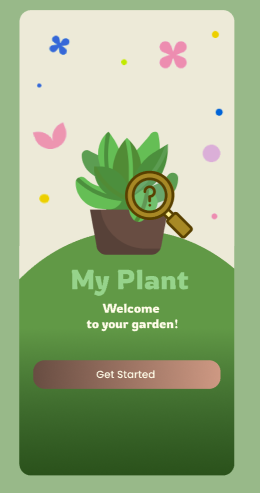 | 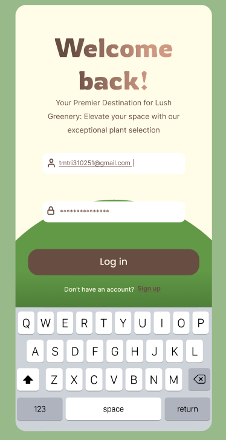 | 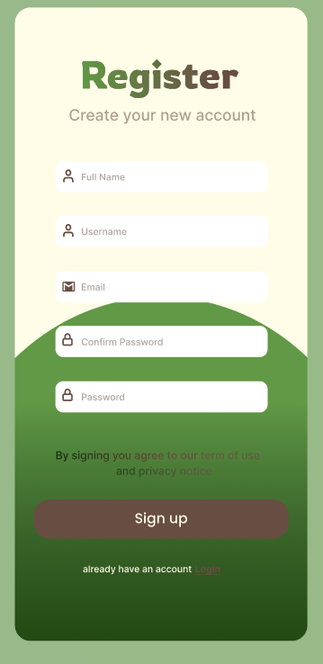 |
| **Welcome Screen** | **Login** | **Create Account** |

</div>

---

### 🏠 Main Experience

<div align="center">

| Home |
|:---:|
| 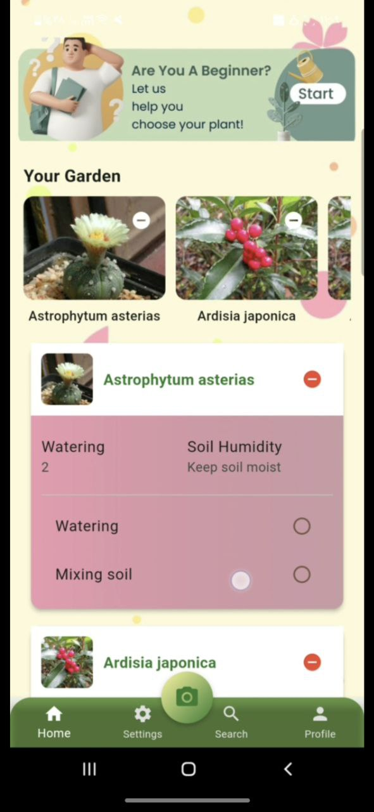 |
| **Home Dashboard** |

</div>

---

### 🔍 Search & Discovery

<div align="center">

| Search | Plant Details |
|:---:|:---:|
| 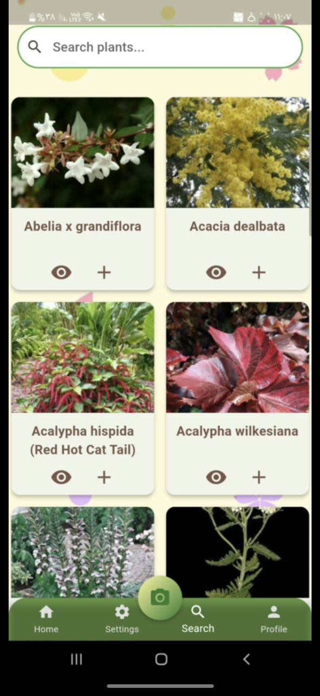 | 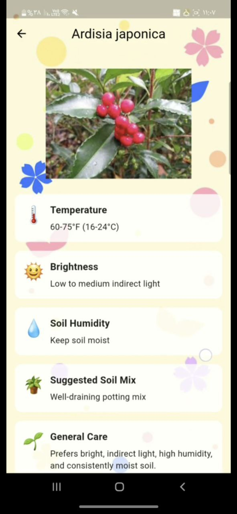 |
| **Search Plants** | **Detailed Plant Info** |

</div>

---

### 💡 Recommendations

<div align="center">

| Recommendations | Recommended Plant |
|:---:|:---:|
| 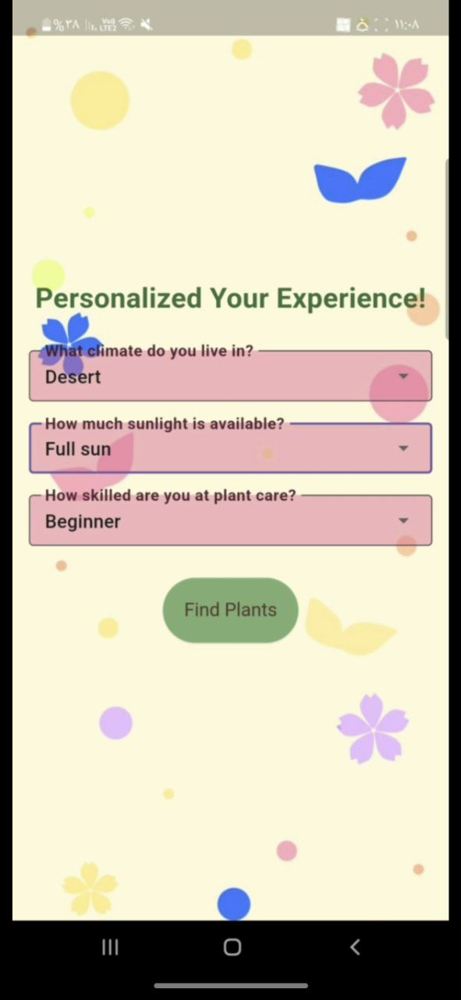 | 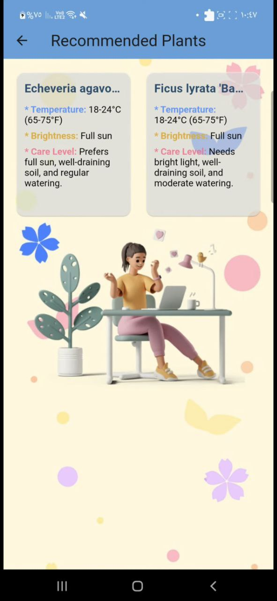 |
| **Personalized Suggestions** | **Plant Details** |

</div>

---

### 🤖 AI Disease Detection

<div align="center">

| Diseased Plant | Healthy Plant |
|:---:|:---:|
| 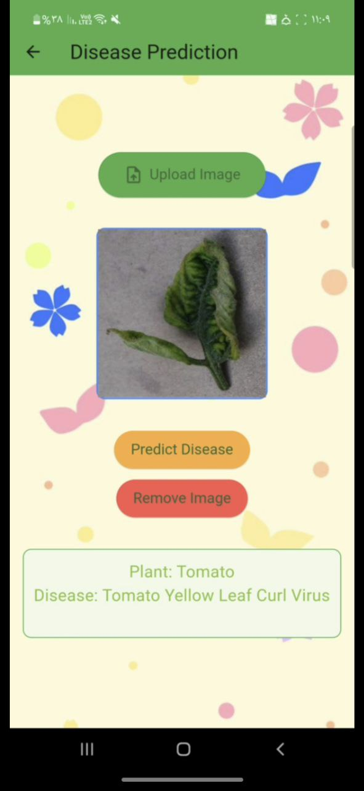 | 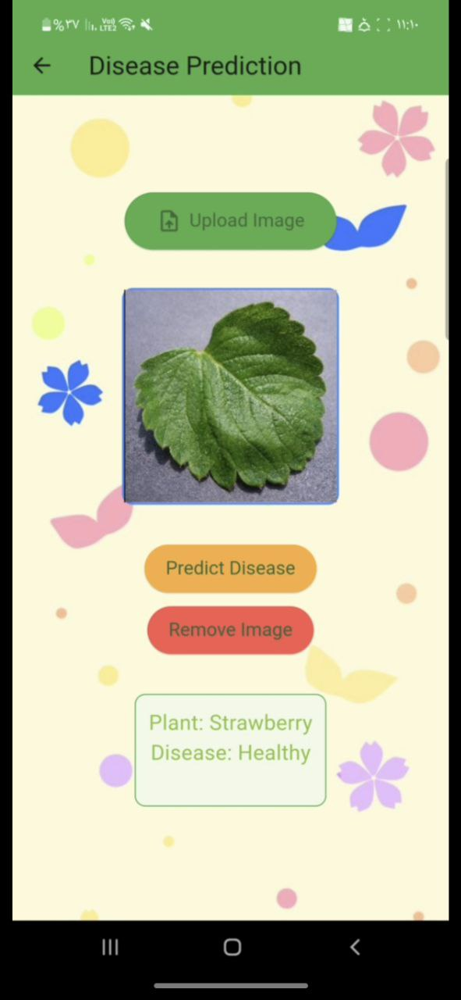 |
| **Disease Detected ⚠️** | **Healthy Plant ✅** |

</div>

---

### ⚙️ Settings

<div align="center">

| Change Password | Settings |
|:---:|:---:|
| 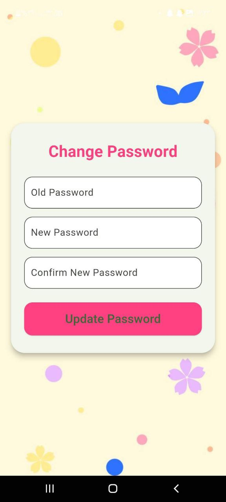 | 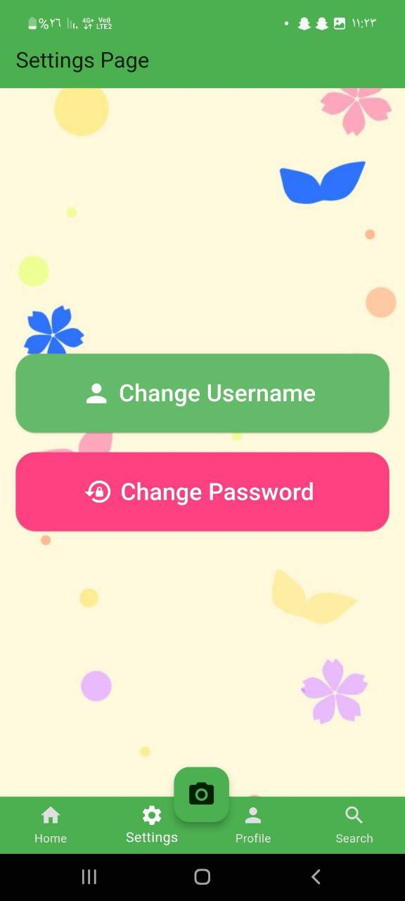 |
| **Change Password** | **App Settings** |

</div>

---

## 🛠️ Tech Stack

<div align="center">

| Layer | Technology |
|:---|:---|
| 📱 Mobile App |   |
| 🔥 Backend |  |
| 🌐 AI Bridge |  |
| 🤖 AI Model |     |
| 🎨 UI/UX Design |  |

</div>

---

## 🎥 Demo & Design

| Resource | Link |
|:---|:---|
| 🎥 Project Demo Video | [Watch on LinkedIn](https://lnkd.in/dktB7MNS) |
| 🎨 Figma UI/UX Design | [Explore Design](https://lnkd.in/djhDUmqG) |

---


## 👩‍💻 Team Members

<div align="center">

A big shoutout to the amazing team behind MyPlant Care! 🌟

| | Member |
|:---:|:---:|
| 🌿 | **Youssef Hesham** |
| 🌿 | **Hana Nabil** |
| 🌿 | **Adham Hamam** |
| 🌿 | **Tasneem Mostafa** |
| 🌿 | **Menna Walid** |
| 🌿 | **Hend Elshazly** |

</div>

---

## 📌 Project Status

> ✅ **Completed** &nbsp;&nbsp;|&nbsp;&nbsp; 🔒 **Source Code: Private**

---

<div align="center">

*Made with 💚 and a love for plants*

`#Flutter` `#DeepLearning` `#PlantCareApp` `#AI` `#CNN` `#Firebase` `#Flask` `#Figma`

</div>
